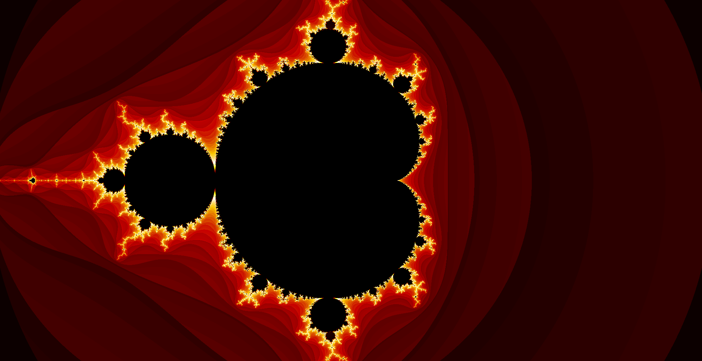

# Mandelbrot set Visualization

The website can be found [here](https://sushiwaumai.github.io/Mandelbrot-Visualization/)

This project uses WebGL 2 and shaders to compute the mandelbrot set.



## Development

### Prerequisites
- nodejs
- yarn

### Getting Started

Clone the repository
```bash
git clone https://github.com/SushiWaUmai/Mandelbrot-Visualization.git
cd Mandelbrot-Visualization
```

Install all packages and start developing
```bash
yarn install
yarn dev
```

## License

This project is licensed under the [LICENSE file](LICENSE)
