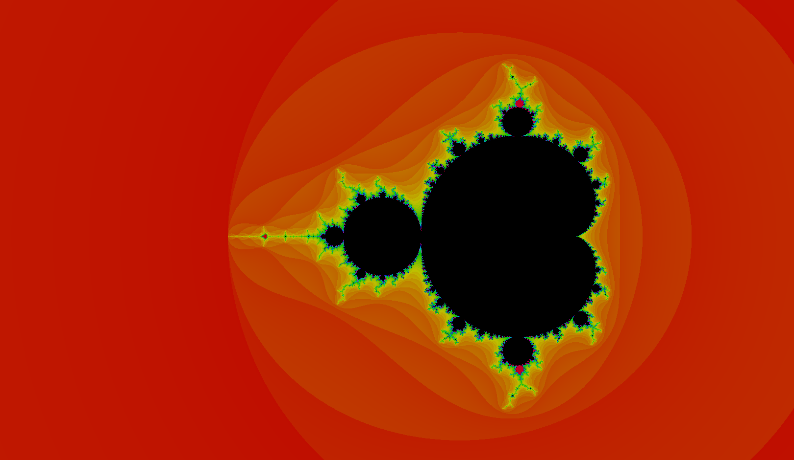

# Mandelbrot set Visualization

The website can be found [here](https://sushiwaumai.github.io/Mandelbrot-Visualization/)

This project uses WebGL 2 and shaders to compute the mandelbrot set.

## License

This project is licensed under the [LICENSE file](LICENSE)
